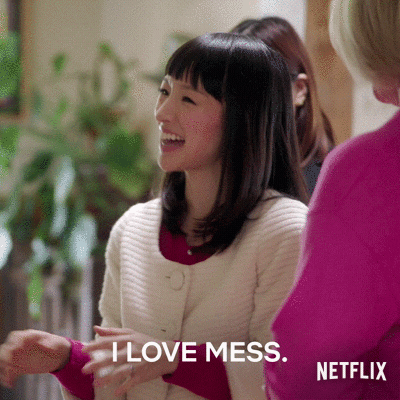

After taking a break earlier this year, I am excited to announce that I am officially looking for my next career adventure, interviewing now with the goal of beginning with a company in early CYQ3 this year (August - September preferred).

For prospective employers, I have put together a reverse job posting, using the approach I've seen most recently used by the amazing Julie Pagano (<a href="https://juliepagano.com/blog/2022/04/21/available-for-work-late-2022/" target=new>hire her!</a>). I hope this format will prove useful for folks who want to know a little bit more about me than what's contained within my resume.

- [When](#When)
- [Where](#Where)
- [About me](#About-Me)
- [What I'm looking for](#what-im-looking-for)
    - [Location](#location)
    - [Working Hours](#working-hours)
    - [Size](#size)
    - [Type of work](#type-of-work)
    - [Culture](#culture)
    - [Extras](#extras)
    - [Pros](#pros)
    - [Cons](#cons)
    - [Deal-breakers](#deal-breakers)
- [Contact me](#contact-me)
- [FAQs](#faqs)

## <a id="When">⌚️ When</a>

While I am actively engaging in interview discussions beginning **now**, please be aware that **my preferred earliest start date is Monday, August 1st**, and **my latest preferred start date is Monday, October 3rd**. 

That said, if your preferred start date for an open role is earlier than this time frame, I am open to the discussion regarding an earlier start date. Let's chat!

## <a id="Where">🌎 Where</a>

I live in Seattle, WA. I am exclusively looking to join remote / distributed-first organizations.  

While I am open to work travel once the COVID-19 pandemic is over, at this current time I will not be open to travel based on the virus transmission levels within the US. That said, I am happy to organize or attend any organizational events remotely.

I deeply miss collaborating with colleagues in in-person settings (summits, off-site events, etc.), and I am looking forward to a future where it is safe to return to this type of collaboration.  

## <a id="About-Me">👩🏻‍🎤 About Me</a>

If you are looking for high-level information about my professional experience, please refer to [my resume](brenna-flood-resume.pdf) or <a href="https://www.linkedin.com/in/brennaflood" target=new>LinkedIn profile</a>.

I am a queer, bilingual (English, Spanish) dual (Bermudian, American) citizen who was half-raised in Bermuda, half-raised in Las Vegas, Nevada. My cultural and personal identity is a fabric based on those truths.

I've been working in the tech industry for over 20 years, beginning with an entry-level support role. I learned and progressed over a landscape of different interests, mastering each and moving towards my passions as I went: Technical Support, Systems Engineering, Software Quality Assurance, Build and Release Engineering, and Production Engineering / SRE. 

While I have a college education (with educational emphasis in the areas of political science, environmental science, economics), everything I've learned about the industry - technologies, processes, and procedures - has all been self-taught: Exploration through reading, attending conferences, hands-on learning, talking to field experts, and attending specific trainings. 

I enjoy working with others to solve complex problems to make communities better. I am adept at understanding organizations and systems at a macro-level as well as a micro-level, and my managering is a reflection of this understanding. I am highly organized and love building helpful, concise documentation frameworks to help people express ideas and hone engagement and learning. I care about outcomes. I optimize towards learning, reflection, then action: Move deliberately and fix things. 

I care very deeply about people, and believe that treating folks with kindness and respect in the workplace should have, at a minimum, equal care and weight as OKRs, KPIs, or other business objectives, as it's **people** that complete those business objectives. <a href="https://www.investopedia.com/financial-edge/0711/the-cost-of-hiring-a-new-employee.aspx" target=new>Hiring is expensive</a>. <a href="https://www.marcusoft.net/2017/09/teams-are-immutable-cooperation-structures.html" target=new>Teams are immutable</a>. <a href="https://hbr.org/2017/08/high-performing-teams-need-psychological-safety-heres-how-to-create-it">Building trust and psychological safety</a> ultimately builds high-performing, creative teams - vital building blocks to the health of any business.

There's so much more I would detail, but I'll leave you with the following potential conversation-starters. I can tell you many tales about wide changes (configuration management, virtualization,emerging technologies, etc.) I've seen in the industry over my career, and (probably) why the changes happened. I can tell you all about all the times/ways I've broken production, or worked through the pain of multi-hour production deployments, or have reduced cycle time from months to days to hours to minutes, and why those time scales have massive impacts for organizations. I can tell you all about the amazing, smart, incredible people I've had the distinct honor and privilege to work with. I can tell you about that one time I made 10+ muppet-style puppets to put on a show with two of my favorite people, sending a love letter to our favorite conference talks for one of my favorite programming languages. 

If any of my story and experience is compelling to you, and you'd like to reach out to me, here's some of the things I am looking for...

## <a id="what-im-looking-for">🔎 What I'm looking for</a>

In my next adventure, I am looking for an organization that cares about and supports:

👥 **People.** What is the company strategy and philosophy regarding employee retention and support? What do you value in the interviewing experience? Offer? Pay and Benefits? Career progression and learning? What practices and procedures do you have in support of DEI and healthy cultures? What are the key areas where the company is making investments? 

Every company has this challenge to get these questions right for the needs of the business. Some companies care and actively reflect on how to evolve and strengthen values surrounding employee care, and others - based on many business reasons - don't prioritize people. I prefer to be a part of businesses who make big bets on their people.

🧱 **Sustainability**. Is it clear how decisions are made at the company? If not entirely clear, what discussions, forums, actions are happening to gain better clarity? Is roadmapping discussion unidirectional or bi-directional? What is the company burn rate? What is the runway? LTV? CAC? As a manager, what tools do I have at the ready to engage and collaborate with folks to ensure business objectives are met?

📜 **Clear, Moral Mission and Values**. The past few years have been particularly challenging - for businesses, communities, and individuals. With the increased intensity of climate change, societal change, I believe that it's important - now more than ever - to join an organization with a clear, actionable company mission that results in a net-positive good for communities around the world.  Good examples of what I'm talking about: Direct support of clean technology, providing equity to communities without access, providing technology that makes people happier and healthier (music production, education, information discovery, etc.). Beyond this, what forums or communication loops does the company have to encourage discussion about what moral or ethical implications surrounding the things we are building?

💰 **Equitable Level and Compensation**. Commensurate with my level of technical leadership and management experience, level and pay aligned with M2 described in many tech organizations for the Seattle area <a href="https://www.levels.fyi/comp.html?track=Software%20Engineering%20Manager&search=M2&region=819&yoestart=5&yoeend=10&yoeradio=Senior%20Level&workarrangement=Remote" target=new>(levels.fyi)</a> is appropriate.

### <a id="location">🏙 Location</a>

It doesn't matter much to me where the company HQ is, as long as the People team can support US, Bermuda, **or** Canada-based employees (taxes, benefits, etc.).

### <a id="working-hours">🎹 Working Hours </a>

My preferred working hours are between 9AM - 5PM Pacific, with room for flexibility to tend to the normal day-to-day things: Have lunch, get exercise, or step away for a walk to reflect so that I can make the best, forward-thinking, creative solutions in support of my colleagues. 

### <a id="size">🎚 Size</a>

My ideal organization size is between **50 and 250 employees, where I am managing 6 - 15 people (managing ICs or managing managers)**. I am very comfortable managing at this level and will remain happy managing at this level for the forseeable future.

If this company size doesn't fit your org, I may still be open to speaking with you about roles if you are in a place where there's sprawl and complexity, you have identified at an org level that change is needed, and you intend to hire someone with the budget and latitude to make changes happen. I have a proven track record across my career to be able not only evaluate areas of change and conduct audits, but also fulfilling the commitment of making changes happen in support of reduced technical complexity and tool cost reduction (while documenting and standardizing along the way).

### <a id="type-of-work">🧩 Type of Work</a>

I am interested in managing a SDET, QA, CI/CD, Infra, Release, Platform, or DevOps team/organization. I've managed single teams (4-6 FTE) and I have also managed multiple teams with entirely different functions simultaneously (4-6 FTE; 2-3 contractors). While I feel comfortable with managering at both scopes, when starting at any company I'd prefer managing a single team before segueing to managing multiple teams, in order to ensure I have time to learn as much as I can about the company, setup, people, etc. before branching out in management responsibility.

### <a id="culture">💞 Culture</a>

**People**: Smart, Kind, Growth Mindset, and open to change, empathetic, and inclusive. Prefers data-driven decisions and changes.  

**Remote work & flexibility**: Teams have the tools they need to collaborate effectively without being in the same room. People are comfortable with asynchronous communication to account for teammates with varying schedules and time zones. Meetings are used thoughtfully and sparingly to ensure people have focus time to complete heads down work like coding.

**Communication and Feedback**: Folks in the organization embrace true bi-directional feedback across the business. No matter who or where you are in the organization - from IC to C-level leadership: A genuine interest in getting candid, kind feedback. Folks believe that receiving constructive, actionable feedback is a gift.

**Collaboration**: Folks work together as a team to solve problems. Work is not done on islands or in secret. <a href="https://hbr.org/2021/03/does-your-company-lurch-from-crisis-to-crisis" target=new>Prefers "No Hero" culture</a>. People err on the side of writing things down to share information with others.

**Work/Life Balance**: You prefer to work smart at a sustainable pace, so you are successful with a low risk of burnout. People work about ~40 hours a week or less and accomplish a lot because of focus and alignment. Working on nights or weekends only happens rarely in extreme situations. When people leave work at the end of the day or go on vacation, they are able to disconnect.

**Celebration**: The company makes space for celebrating teams for their work and reaching key milestones - not only through shoutouts, but through team events as well.

### <a id="extras">👑 Extras</a>

It would be amazing to speak with companies who have the following policies in place:

- <a href="https://www.4dayweek.com/">Standardized 4-day work week</a>;
- <a href="https://www.bbc.com/worklife/article/20220426-could-menstrual-leave-change-the-workplace" target=new>Menstrual Leave</a>;
- <a href="https://www.hrdive.com/news/paid-time-off-doesnt-work-but-minimum-time-off-does/602674/" target=new>Minimum PTO</a>

### <a id="pros">👍🏻 Pros</a>

I am looking for the following benefits in my next company:

- **Your company has a great mission and values framework. Bonus points to work involving environmental science, education, indie gaming, art, or music.**
- **A flexible working schedule**. As mentioned earlier, I tend to work between 9AM - 5PM Pacific. While I can start/end later in the day by a few hours, I am not available earlier than 9AM.
- **At least 3 weeks paid vacation**. If there is an unlimited PTO policy, I want to know more about what mechanisms are in place company-culture wise to ensure that folks are getting enough time off to rest and recharge.
- **Unlimited sick leave**.
- **401K match**.
- **Health benefits are mostly or 100% paid for by the company, and includes vision and dental coverage**.
- **Mental health care is included in health care coverage, and is not a 3rd party service offering like Ginger**. 
- **Additional time off in support of learning, conferences, outreach, and volunteerism.**

### <a id="cons">👎🏻 Cons</a>

- **You have recently had or expect to have an executive leadership change.** While I'm still open to discussing roles, I will want to take additional time in discussion to understand why the change is happening, as well as what the strategy pivots the business will have to make to responsibly adapt (hiring the new leader and what the interview process is like, evaluating in-flight projects, staffing, etc.)
- **The role has little to no functional or fiscal agency to direct and manage positive team or organizational change.**
- **Existing policies and procedures in the company are inflexible, or company is not open to change.**
- **On-call expectation.**
- **Employee support/DEI:**
    - **The DEI head reports to HR/People team**. I'll want to have a conversation with you about how you manage to separate potential conflicts of interest.
    - **Affinity groups are expected to be led by employees with no additional compensation or acknowledgement of the additional time commitment.**
- **Security team**:
    - The team is fewer than 3 people and/or security consulting is not actively engaged for systems audits and remediation.
- **Actively contributes to political causes.** I'll want to have a conversation with you about where the company donates (GOP? Democrat? ACLU? etc.) within any given year, with the reasons why.

### <a id="deal-breakers">🚫 Deal-breakers</a>

Below are company deal-breakers - your company goals/interests/policies and mine are not aligned:

- **Type of company/work**: 
    - **Your company is Google, Meta, Amazon, Microsoft, Starbucks, Palantir**. Additionally, if your company engages in any of the following, I am not interested in working for you:
    - Aggregation and use of PII data with the goal of influencing, marketing, or otherwise manipulating people without their knowledge or consent (ala Cambridge Analytica);
    - Gig work;
    - Associated with weapons, arms, defense, police. Additionally, any collaboration with private or governmental institutions (Eg. DOD, DHS, ICE, CIA, FBI; Lockheed-Martin, etc.)
    - Anything involving blockchain, crypto, NFTs, web3, etc.;
    - Actively engaged in union-busting.

- **Interviewing Expectations**: 
    - **Inclusion of any coding exercise - take home or otherwise**. I am interviewing for a management role, not an IC role. If you want to get an idea of my understanding of programming, please refer to my <a href="https://github.com/brennx0r" target=new>Github profile and project repos</a>.  
    - **Multi-hour take home exercise**. I will be interviewing with many companies, and I don't have the time to engage in that scope of time investment.  
    
- **Working Requirements:**
    - Expectation to work in an office in a part-time or full-time capacity;
    - Travel (during the pandemic)

- **Culture and Dynamics:**
    - Expects off-hours communication;
    - Any sector of employees within the company are not given a living wage or inclusive hours

- **Employee support/DEI:**
    - **You don't have an HR team.**
    - **You don't have a recruiting team.**
    - **You cannot disclose employee demographic information when requested by me or anyone else within a reasonable amount of time.**
    - **You don't have any women/non-binary folks in engineering leadership.**

- **Engineering management roles where the working expectation is to manage and also directly make code contributions to projects.** I personally don't believe that great management for a team can happen where the manager is also directly contributing. In addition to issues relating to contributions and power dynamics, I think the decreased focus on people management will result in negative outcomes for everyone.

## <a id="contact-me">☎️ Contact me</a>

If what I've written resonates with you and you'd like to speak with me about roles at your company, <a href="https://calendly.com/brennaflood" target=new>please book time with me to chat</a>! So that I'm prepared for the conversation, please include a little bit about yourself, the role/req, and a little bit about the company. Looking forward to speaking with you. 💜 

## <a id="faqs">FAQs</a>

This section is new - as questions are asked, this section will be updated.